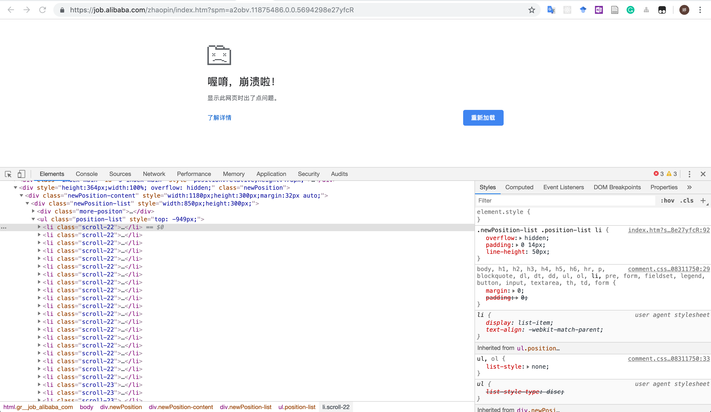

# Alibaba-Job-FrontPage

阿里招聘官网首页 React 实现。

- Live Demo

## Quick Overview

```bash
cd Alibaba-Job-FrontPage
npm start
```

打开 [http://localhost:8080](http://localhost:8080) 即可访问页面。

当准备部署到生产环境时，需使用 `npm run-script build` 进行发布。

## 改进
- 改进原页面「招聘职位列表」自动循环滚动而可能导致页面崩溃问题
